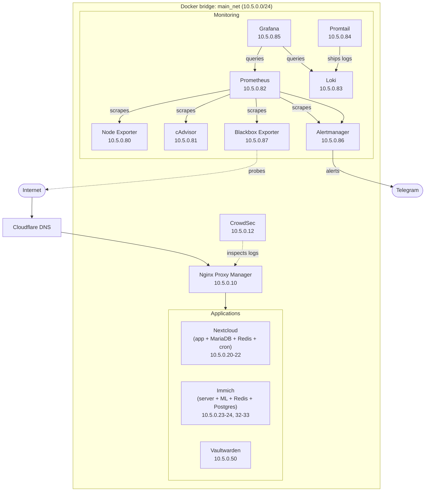

# Network diagram

## Logical topology



## IP assignments

| Range | Purpose |
|---|---|
| `10.5.0.10` | Nginx Proxy Manager |
| `10.5.0.12` | CrowdSec |
| `10.5.0.20 - 10.5.0.22` | Nextcloud stack (DB, Redis, cron) |
| `10.5.0.23 - 10.5.0.24` | Immich DB and Redis |
| `10.5.0.32 - 10.5.0.33` | Immich server and ML |
| `10.5.0.50` | Vaultwarden |
| `10.5.0.80 - 10.5.0.87` | Monitoring stack |

The `10.5.0.90+` range is reserved for future services.

## Traffic flow

**Inbound public traffic** hits Cloudflare, which resolves to the server's public IP (kept current by the DDNS container). Nginx Proxy Manager receives it on port 80/443 and proxies to the correct container based on the hostname.

**CrowdSec** watches NPM's access logs and the host's auth logs. It bans IPs that trigger detection rules and shares those bans with the CrowdSec threat intelligence network.

**Monitoring** is entirely internal. No monitoring port is exposed publicly. Grafana is accessible only through NPM with authentication.

**Alertmanager** is the only service that reaches out to the internet on its own, via the Telegram Bot API.

## Network creation

The `main_net` network is created by the Ansible `networking` role before any services start:

```bash
docker network create \
  --driver bridge \
  --subnet 10.5.0.0/24 \
  main_net
```

The network is defined as `external: true` in every compose file, so Docker Compose does not try to recreate or manage it.
